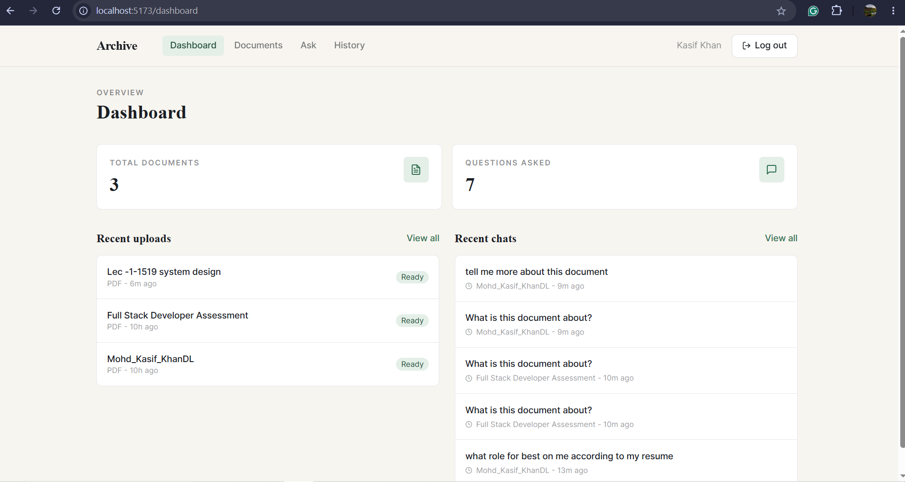
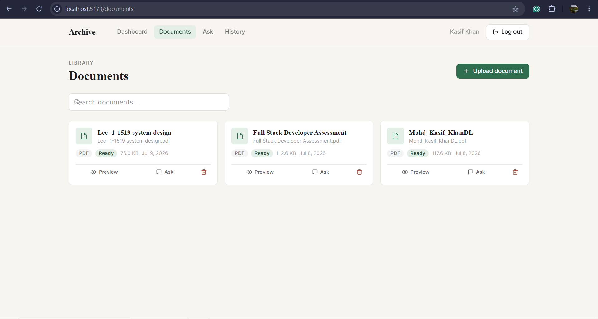
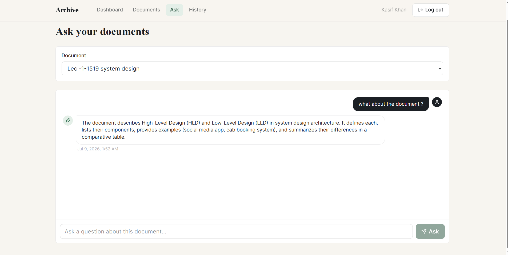
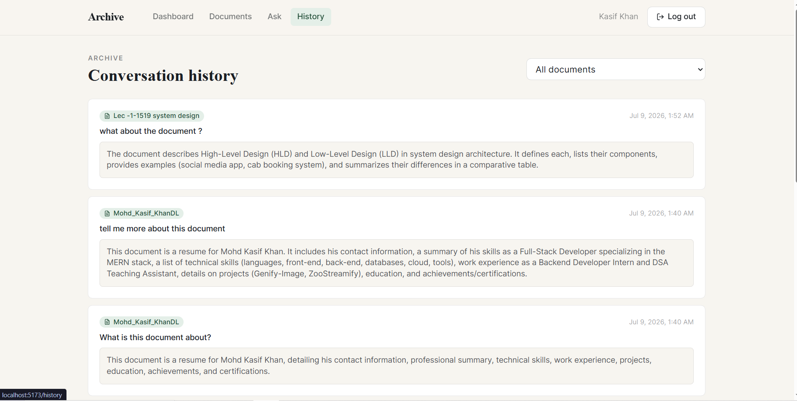
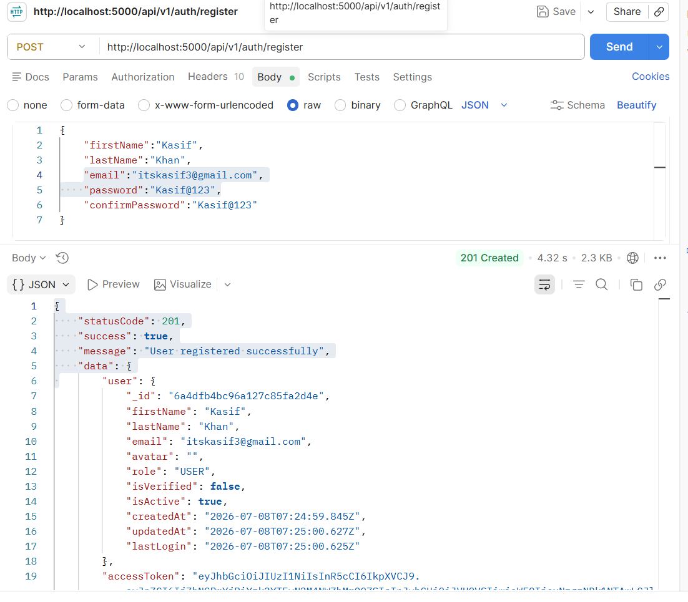
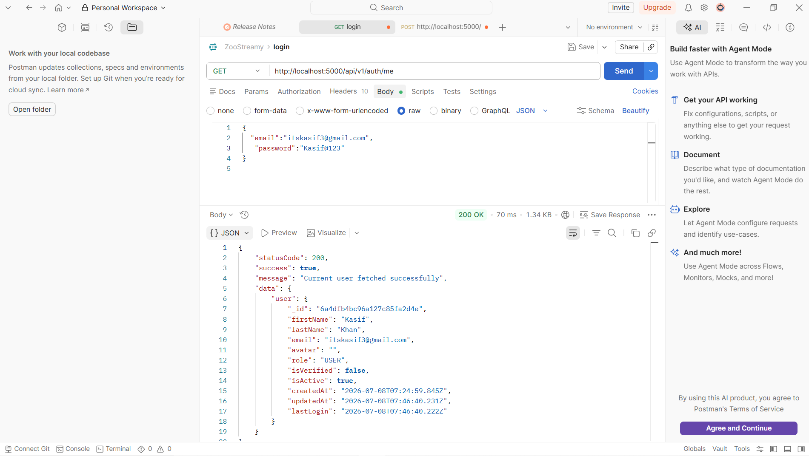
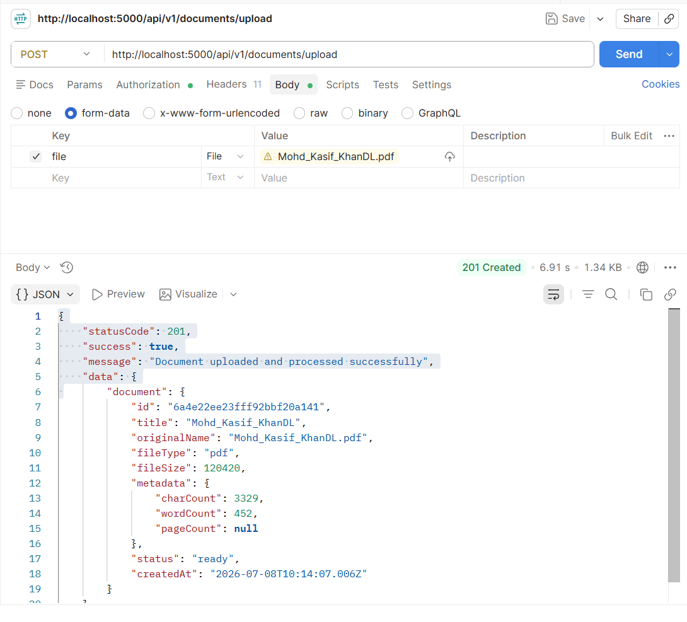
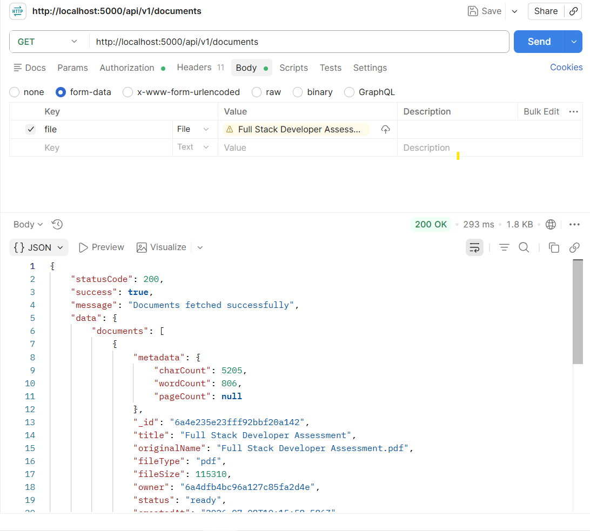
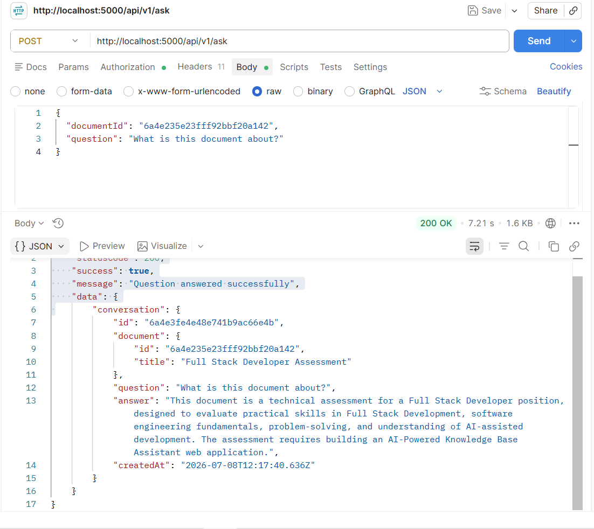
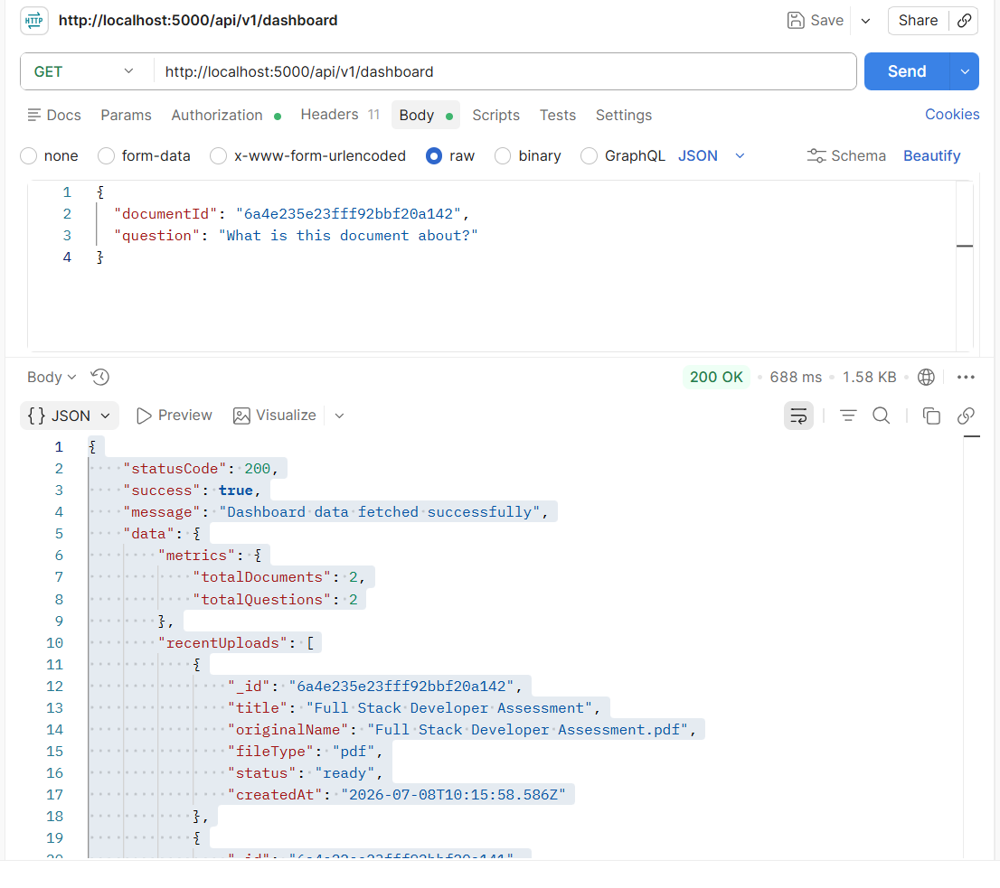

# 🤖 AI-Powered Knowledge Base Assistant

A full-stack MERN application that allows authenticated users to upload PDF documents, extract text, search document content, and interact with an AI assistant powered by Google's Gemini API.

---
# 📷 Final Look of WebPage

## Dashboard Page



---
## Documents Page



---

## Ask Page / Query Page



---

## History Page



---

# 🚀 Features

- 🔐 JWT Authentication & Authorization
- 📄 PDF Upload
- 📑 PDF Text Extraction
- 🔍 Full-text Document Search
- 👀 Document Preview
- 🗑️ Delete Documents
- 🤖 Gemini AI Integration
- ⚡ REST APIs
- 🛡️ Error Handling & Validation

---

# 🛠 Tech Stack

### Frontend

- React.js
- Vite
- Tailwind CSS
- Axios

### Backend

- Node.js
- Express.js
- MongoDB
- Mongoose
- JWT
- Multer
- pdf-parse

### AI

- Google Gemini API

### Tools

- Git
- GitHub
- Postman

---

# 📁 Project Structure

```text
AI-Powered-Knowledge-Base-Assistant/
│
├── client/
│   ├── src/
│   ├── public/
│   └── package.json
│
├── server/
│   ├── config/
│   ├── controllers/
│   ├── middlewares/
│   ├── models/
│   ├── routes/
│   ├── services/
│   ├── uploads/
│   ├── utils/
│   └── server.js
│
├── ScreenshotImageofPostman/
│   ├── login.png
│   ├── upload-document.png
│   ├── search-document.png
│   └── ai-chat.png
│
├── README.md
├── ARCHITECTURE.md
├── AI_USAGE.md
└── DEBUG_NOTES.md
```

---

# ⚙️ Installation

## Clone Repository

```bash
git clone https://github.com/Kasif17/AI-Powered-Knowledge-Base-Assistant.git

cd AI-Powered-Knowledge-Base-Assistant
```

## Install Backend

```bash
cd server
npm install
```

## Install Frontend

```bash
cd ../client
npm install
```

---

# 🔑 Environment Variables

Create a `.env` file inside the **server** folder.

```env
PORT=5000

MONGO_URI=your_mongodb_uri

ACCESS_TOKEN_SECRET=your_secret
ACCESS_TOKEN_EXPIRY=1d

REFRESH_TOKEN_SECRET=your_secret
REFRESH_TOKEN_EXPIRY=7d

GEMINI_API_KEY=your_gemini_api_key
```

---

# ▶️ Run Project

## Backend

```bash
cd server
npm run dev
```

## Frontend

```bash
cd client
npm run dev
```

---

# 📌 API Endpoints

## Authentication

```
POST   /api/v1/users/register
POST   /api/v1/users/login
POST   /api/v1/users/logout
POST   /api/v1/users/refresh-token
GET    /api/v1/users/profile
```

## Documents

```
POST    /api/v1/documents/upload
GET     /api/v1/documents
GET     /api/v1/documents/:id
DELETE  /api/v1/documents/:id
GET     /api/v1/documents/search?q=developer
```

## AI

```
POST /api/v1/ai/chat
```

---

# 📷 API Demo

## Document Search API

The following screenshot shows the successful response of the **Document Search API**.


---

# 🔮 Future Improvements

- OCR support for scanned PDFs
- Semantic Search using Embeddings
- Redis Caching
- Docker Deployment
- AWS Deployment
- Role-Based Access Control
- Chat History
- Unit Testing
- Integration Testing
- Vector Database Support

---

# 👨‍💻 Author

**Mohd Kasif Khan**
**itskasif3@gmail.com**
---

# 📷 Postman API Screenshots

## Register



---
## Login



---

## Upload Document



---

## Search Document



---

## AI Chat



## DashBoard



---